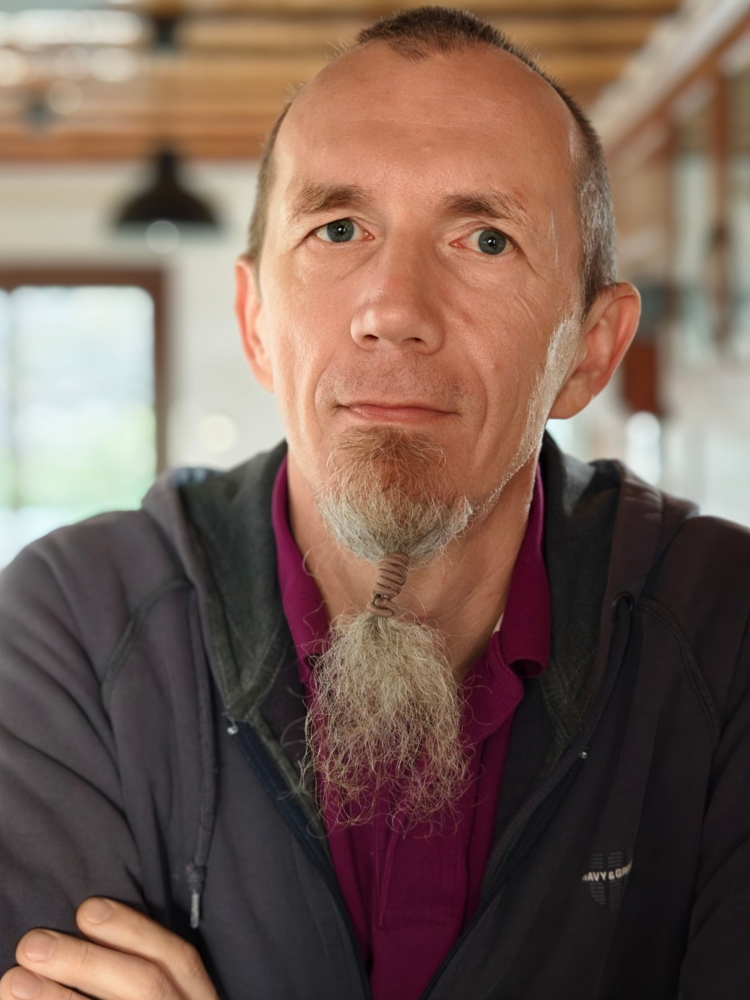

{ .profile-photo }

My name is Jacek Gębal. I was born in 1977 in Głogów, Poland.

You are reading my personal blog about Oracle PL/SQL and software development.

On this page you can get to know a bit about my journey through technology and software development. 

## The Beginning

My passion for computers started in the 1980s, when my father assembled a ZX81 for me and my brother. I was around 8 or 10, living in communist Poland, and I was fascinated by the idea that I could instruct a machine to do something for me. That curiosity never left.

In 1998 I started my adventure with Oracle databases, working on an OLTP system built on Oracle 8i. That was where I first encountered Oracle Reports, wrote my first complex SQL queries, learned to read Explain Plans, and began programming in PL/SQL.

## Warsaw and Data Warehousing

After less than two years I moved to Warsaw, where I joined a company as a Junior Oracle Developer and spent over seven years building a Data Warehouse for Era (now T-Mobile). Working alongside many talented people, I pushed myself to write effective code for high-volume data processing, and learned that solving performance problems sometimes means digging very deep to find the real root cause.

My PL/SQL journey continued when I moved to a Data Warehouse project for the Polish branch of AEGON insurance group. This was where my focus broadened beyond ETL. I worked closely with business users, learned Business Objects (SAP's BI reporting solution), and spent two years mastering complex data models for demanding reporting requirements. Those interactions changed how I think about software. No matter how elegant and well-performing your ETL code is, users simply want their reports on time and without friction. That insight drove a natural evolution toward agility, even before I had a name for it.

## Pragmatists and the Agile Turn

In 2011, after eleven years at Pentacomp and increasingly frustrated with maintenance work and company policy, I made a decision to own my career and joined Pragmatists.

Working there was a turning point. It was a truly agile team focused on delivery, continuous integration, test automation, and short feedback loops. Pawel Lipinski and many others made it a unique environment. I learned things there that permanently changed how I approach my work:

- It is better to speak up and say something imperfect than stay quiet.
- It is fine to disagree, and fine when others disagree with you.
- Agility is not chaos. In fact, it is further from chaos than waterfall.
- A team is not a group of individuals sitting in the same room. It is something harder to build and more valuable when you find it.
- Test Driven Development is a discipline, not just a technique. I ported it into database development using RSpec and ruby-plsql, and implemented Automated Acceptance Tests at the database layer using Gherkin and Cucumber.

## Fidelity Investments

In April 2015 I moved to Ireland and joined Fidelity Investments in Galway, initially as a Senior Oracle Developer. Over the following years I progressed through increasingly senior roles:

- **Senior Oracle Developer** (2015 - 2017)
- **Principal Database Engineer / Developer** (2017 - 2018)
- **Project Tech Lead** (2018 - 2021)

Working at Fidelity opened up a new scale of challenges: large distributed systems, enterprise-grade delivery pipelines, and the opportunity to work with and learn from excellent engineers and leaders. My former manager Philip O'Dwyer had a significant influence on my communication and leadership skills during this period. I also had the opportunity to speak at several Oracle user group conferences, including UKOUG, POUG, BGOUG, ODTUG, and OUG Ireland, presenting on unit testing, TDD, and CI/CD for Oracle database development.

## utPLSQL v3

Alongside my work at Fidelity, I became the lead architect, primary developer, and custodian of utPLSQL v3, a free and open-source unit testing framework for Oracle SQL and PL/SQL. utPLSQL v2 had been created by Steven Feuerstein in 1999 but had not been maintained for years. Version 3 was a complete rewrite, built from scratch with modularity and CI/CD integration as first-class concerns.

Development started in 2015 and took over a year of after-hours, weekend, and late-night work before the initial release in May 2017. The project is self-tested, continuously deployed to the cloud, and integrates with SonarCloud, GitHub Actions, Docker, and all major CI/CD servers. Within months of its release it had been downloaded thousands of times and adopted by multiple companies worldwide, including Fidelity Investments.

In 2017, utPLSQL v3 won the ITAG (Irish Technology Association Group) Excellence Award, recognising it as an outstanding contribution to the Irish technology community.

I continue to maintain the utPLSQL project and its surrounding ecosystem, including utPLSQL-cli and utPLSQL-java-api, to this day.

## Oracle ACE

In recognition of contributions to the Oracle community through utPLSQL, conference speaking, and technical writing, I was awarded the title of Oracle ACE. I am currently an Oracle ACE Alumni.

## Smart Enterprise Solutions

In November 2021 I left Fidelity and joined Smart Enterprise Solutions GmbH as a Software Engineer. I continue to work on enterprise integration and Oracle database engineering, applying the same values around quality, automation, and continuous improvement that have shaped my entire career.

## What I Believe

Some things have stayed constant across twenty-five years of building software:

- Good software is software that meets real user needs, delivered reliably. Technical elegance matters, but only in service of that goal.
- Trust is built through transparency and honesty, not through polishing.
- Testing is not a phase at the end of a project. It is how you know what you built actually works.
- The best thing about working in technology is the people. Learning from others, sharing what you know, and watching a group grow into a real team is genuinely the most satisfying part of the job.

